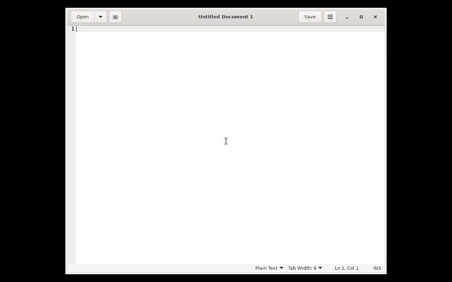
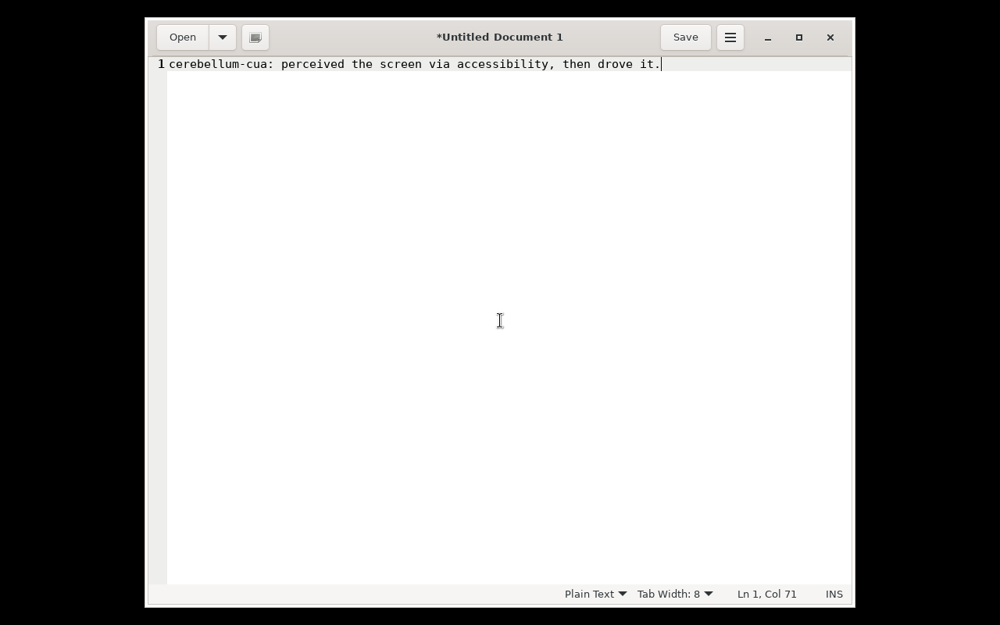

# cerebellum-cua

Captures the operating-system **accessibility tree** (Windows UI Automation or
Linux AT-SPI) into a versioned **relational matrix** of UI elements and serves it
to agents over a token-bounded, line-delimited JSON (**JSONL**) protocol.
Perception is **hybrid**: the token-efficient accessibility tree is the default,
and an **optional, on-demand screenshot** is available for visual verification
when the a11y tree is insufficient (for example, custom-drawn or canvas UIs). No
vision model is bundled; the screenshot is a separate, opt-in operation and is
never taken automatically.

`cerebellum-cua` is the perception layer ("eyes") of the broader **Cerebellum**
project. It can also be used standalone as a computer-use-agent (CUA) capture
backend.

> Status: **v0.1.0, early.** The engine, storage, matrix, gateway, protocol and
> both capture backends are implemented and unit-tested. Live capture has been
> exercised end-to-end on Linux and **validated on real Windows 11** (the UIA
> backend captures the live desktop), though it is **not yet validated against a
> broad set of applications**. See [Limitations](#limitations) and
> [ROADMAP.md](ROADMAP.md).

## Demo

A single high-level skill driving a real app inside an isolated virtual desktop —
`run_skill type_into` perceives the screen via the accessibility tree (no
screenshot), moves the cursor to the field, types, then re-captures and verifies
the change. Recorded in the container VM rig (see [docs/MODES.md](docs/MODES.md)).





## What it does

- Reads the live accessibility tree of a desktop session through a pluggable
  **capture seam** — `uia` backend (Windows) and `atspi` backend (Linux), selected
  automatically by OS. A macOS AX backend can be added against the same interface.
- Filters noise (a `should_include` predicate) and builds a dense, 0-indexed
  **relational matrix**: elements plus directed relationships (parent/child,
  sibling, geometry, etc.), with per-element properties and control patterns.
- Persists immutable, epoch-versioned snapshots to **SQLite** (default) or
  **PostgreSQL**, and computes minimal **epoch diffs** for incremental updates.
- Serves the matrix to an agent over **JSONL** with **accordion lazy-loading**:
  the agent receives only top-level context plus on-demand child slices (gated by
  signed, expiring lazy tokens), rather than the entire tree at once.
- Maps raw control types to higher-level domain concepts (`action_button`,
  `text_input`, `menu_item`, …) via heuristic semantic rules.
- Offers an **optional, on-demand `screenshot` operation** so an agent can
  visually inspect the screen when the accessibility tree is insufficient. It is
  opt-in, never part of `build_matrix`, and returns an image file plus its
  dimensions (no analysis is performed).

Sending structured accessibility data instead of screenshots reduces token usage
relative to vision-based approaches — a documented, established technique, not
something introduced here (see [token-cost comparison][token-cost] and
[native-API benchmarks][native-bench]).

Screenshots are not part of the default perception path: the `screenshot`
operation is opt-in and must be called explicitly (see
[docs/PROTOCOL.md](docs/PROTOCOL.md) and
[docs/AGENT_INTEGRATION.md](docs/AGENT_INTEGRATION.md)).

An optional **vision capture backend** (`capture_backend="vision"`) extracts
structured elements from a screenshot for apps that expose no accessibility tree
(games, canvas, custom-drawn UIs). It runs OCR and rectangle detection, then emits
the same structured element records as the accessibility backends — bounding boxes,
text, and a heuristic type guess — not raw pixels, so the token budget is
preserved. It is behind the same capture seam and requires the optional `vision`
extras plus the system `tesseract-ocr` binary; without them it reports itself
unavailable.

## What it does not do

- No bundled vision model. The optional `screenshot` operation returns an image
  file for an external model to inspect; the optional `vision` backend uses OCR
  and rectangle detection (not a neural model) to derive structured elements.
- It is not an autonomous agent and contains no LLM. It is a capture/serving
  layer that an agent (or a human script) drives over JSONL.
- The default accessibility path does not bypass OS accessibility: if an
  application exposes nothing to the accessibility tree, the a11y backends capture
  nothing for it (the optional `vision` backend is the screenshot-based fallback).

## Limitations

- **Accessibility-tree coverage is not universal.** Legacy, custom-drawn, or
  canvas-based applications can expose a near-empty tree; captures of those apps
  will be sparse or empty. The optional `vision` backend covers some of these by
  deriving structured elements from a screenshot, at lower fidelity (types are
  inferred from shape and OCR text rather than read from real roles).
- **Capture latency.** Generating a full tree can take noticeable time on large
  UIs; this is inherent to the accessibility APIs.
- **Linux requires the a11y bus to be running and apps to expose trees.** On
  SELinux-enforcing immutable distributions, enabling it can require extra setup.
  See [docs/INSTALL.md](docs/INSTALL.md).
- **Windows/UIA is implemented but unverified on real Windows** in this project.

## Install

Once published, from PyPI:

```bash
pip install cerebellum-cua                 # core (SQLite backend, JSONL CLI)
pip install 'cerebellum-cua[postgres]'     # + PostgreSQL backend
pip install 'cerebellum-cua[uia]'          # Windows only: live UIA capture
pip install 'cerebellum-cua[vision]'       # screenshot-based capture (also needs system tesseract-ocr)
pip install 'cerebellum-cua[mcp]'          # MCP server wrapper
```

> **Not yet on PyPI.** The PyPI listing lands with the first tagged release;
> until then, install from source (below).

From source (editable, e.g. to develop or to run before the first release):

```bash
pip install -e .                 # core (SQLite backend, JSONL CLI)
pip install -e '.[postgres]'     # + PostgreSQL backend
pip install -e '.[uia]'          # Windows only: live UIA capture
pip install -e '.[vision]'       # screenshot-based capture (also needs system tesseract-ocr)
pip install -e '.[dev]'          # tests + lint
```

Per-OS setup and how to enable
live capture (including the Linux a11y bus and SELinux notes) are in
[docs/INSTALL.md](docs/INSTALL.md). Check which backends are usable on your host:

```python
from cerebellum_cua.capture import available_backends
print(available_backends())      # e.g. ['atspi'] on Linux, ['uia'] on Windows
```

## Quick start (JSONL over stdio)

```bash
python -m cerebellum_cua.cli --db-dsn ./state.db --secret "$(openssl rand -hex 16)"
```

The process prints an `engine_ready` event, then reads one JSON request per line
on stdin and writes one JSON response per line on stdout:

```jsonc
// stdin: capture the current desktop (auto-selects UIA/AT-SPI)
{"operation":"build_matrix","payload":{"target":{},"config":{"max_depth":4}}}
// stdout:
{"type":"response","operation":"build_matrix","payload":{"snapshot_id":1,"epoch":1,"total_elements":184,"root_elements":[0],"status":"success"},"error":null}
```

The core operations (`build_matrix`, `get_element`, `load_children`,
`invoke_action`, `get_snapshot_diff`) plus the rest (`screenshot`, `read_text`,
`read_legend`, `annotate`, `wireframe`, `list_windows`, `run_skill`, `elevate`)
are specified in [docs/PROTOCOL.md](docs/PROTOCOL.md). Using it as a tool inside an
agent (the way Playwright is driven by agents) is covered in
[docs/AGENT_INTEGRATION.md](docs/AGENT_INTEGRATION.md).

## Execution modes

The CLI takes a `--mode` flag that selects defaults for which capture backend to
use and whether actions move a visible cursor:

- `desktop` (default) — attach to the real, logged-in session. Auto-selects the
  capture backend (UIA on Windows, AT-SPI on Linux) and moves a visible cursor so
  the automation looks user-operated. Requires the host accessibility enablement
  described in [docs/INSTALL.md](docs/INSTALL.md).
- `vm` — run inside / against the isolated virtual session brought up by
  [`scripts/run-vm.sh`](scripts/run-vm.sh) (Xvfb + openbox + the AT-SPI bus).
  Forces the AT-SPI backend and keeps the visible cursor on, so a viewer (e.g.
  VNC) attached to the virtual display shows realistic motion.
- `background` — the same isolated session, unattended: no viewer and no visible
  cursor (headless).

```bash
python -m cerebellum_cua.cli --db-dsn ./state.db --secret "$SECRET" --mode vm
```

The isolated session is brought up by [`rig/session.sh`](rig/session.sh). The
recommended way to run it is in its container via
[`scripts/run-vm.sh`](scripts/run-vm.sh) (only `podman` is needed on the host;
the image bundles everything else). To run the rig **directly on a host** you
need these system packages — `rig/session.sh` preflights them and prints the
exact install command if any are missing:

| Binary | Provides | Debian/Ubuntu | Fedora |
| --- | --- | --- | --- |
| `Xvfb` | virtual X display | `xvfb` | `xorg-x11-server-Xvfb` |
| `xdpyinfo` | X readiness probe | `x11-utils` | `xorg-x11-utils` |
| `dbus-launch` | session bus | `dbus-x11` | `dbus-x11` |
| `openbox` | window manager | `openbox` | `openbox` |
| `at-spi-bus-launcher` | a11y bus | `at-spi2-core` | `at-spi2-core` |
| `ffmpeg` | record / screenshot | `ffmpeg` | `ffmpeg` |
| `x11vnc` | VNC server (`STREAM=1` only) | `x11vnc` | `x11vnc` |
| `websockify` | noVNC web proxy (`STREAM=1` only) | `websockify` | `python3-websockify` |

To watch a `vm` session live in a browser or VNC client, `scripts/stream-vm.sh`
serves the isolated display over localhost-bound noVNC/VNC (see the streaming
section of [docs/MODES.md](docs/MODES.md)).

Modes, the rig, and how to build/run/record the isolated session are documented
in [docs/MODES.md](docs/MODES.md).

## How it works

```
 OS accessibility tree  (Windows UIA / Linux AT-SPI)
        │  capture seam  (cerebellum_cua/capture)
        ▼
 should_include filter -> relational matrix builder -> storage (SQLite/Postgres)
        │  (cerebellum_cua/matrix, /storage, /semantics)
        ▼
 accordion gateway + JSONL protocol  (cerebellum_cua/gateway)
        ▼
 agent  --drives-->  build_matrix / get_element / load_children / invoke_action
```

Design details are in [docs/ARCHITECTURE.md](docs/ARCHITECTURE.md).

## Related capabilities

An **adjacent media pipeline** (`cerebellum_cua.media`) can understand and edit
video token-cheaply — detecting motion/scene segments and rendering a crossfade
edit while the agent reasons only over a structured cut-list. It is a sibling
capability, not part of the UI capture core. See [docs/MEDIA.md](docs/MEDIA.md).

## Related work

Using the accessibility tree (rather than screenshots) for computer-use agents is
an active area. See, among others, Microsoft's [UFO/UFO2][ufo] (Windows UIA) and
[computer-use-linux][cul] (AT-SPI over MCP). `cerebellum-cua` is one
implementation in this space; it does not claim to outperform these.

## Development

```bash
pip install -e '.[dev]'
pytest                       # Windows/Postgres-marked tests auto-skip
ruff check src tests
```

Contribution guidelines, the module rules, and how to add a capture backend are in
[CONTRIBUTING.md](CONTRIBUTING.md). Changes are tracked in
[CHANGELOG.md](CHANGELOG.md); development notes in [DEVLOG.md](DEVLOG.md).

## License

[MIT](LICENSE).

[token-cost]: https://dev.to/kuroko1t/how-accessibility-tree-formatting-affects-token-cost-in-browser-mcps-n2a
[native-bench]: https://fazm.ai/blog/benchmarked-ai-browser-tools-token-efficiency-native-apis
[ufo]: https://github.com/microsoft/UFO
[cul]: https://github.com/agent-sh/computer-use-linux
